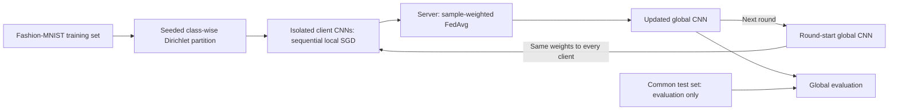

# Trustworthy Decentralized Learning under Non-IID Data and Byzantine Participants

This project develops a reproducible PyTorch framework for studying how heterogeneous data and unreliable participants affect decentralized learning, with an emphasis on transparent experiments suitable for research and extension.

## Current scope

The current codebase provides a small Fashion-MNIST convolutional model, a reproducible centralized training baseline, reproducible Dirichlet client partitioning, and a sequential centralized FedAvg baseline. Decentralized learning, Byzantine behavior, and robust peer selection are outside the current scope.

> **Active development:** This repository is being built milestone by milestone and does not yet contain final research results.

## Development figures

These figures summarize verified Milestones 1–3 development checks, **not final scientific results**. Partition and FedAvg comparisons use one seed (42), 10 clients, the full 60,000-sample Fashion-MNIST training set, and alpha values 10, 1, and 0.3. FedAvg uses three rounds, one local epoch per round, and the common 10,000-sample test set. One seed and three rounds do not establish statistical significance, convergence, or general performance rankings; no confidence intervals are inferred.

### 1. Historical centralized baseline


The original CPU development check (2026-09-14), plotted from the rounded metrics recorded in the research log. This confirms the initial centralized pipeline trained successfully. Epochs are not equivalent to FedAvg communication rounds; this separate historical figure is not a controlled centralized-versus-federated comparison. [Vector version](docs/figures/centralized_baseline.svg).

### 2. Client label distributions


Rows are clients, columns are Fashion-MNIST classes, and each row sums to one. All panels share the same 0–1 color scale. The alpha 0.3 realization shows stronger concentration and missing classes in some clients. Client IDs identify simulated partitions, not real users or matched populations across alpha values. [Vector version](docs/figures/client_label_distributions.svg).

### 3. Client sample counts


All panels use the same sample-count axis. The dashed 6,000-sample line is an equal-size reference, not an enforced allocation constraint. Unequal sizes motivate sample-weighted FedAvg; the realized size imbalance need not change monotonically with alpha. Every panel totals 60,000 samples. [Vector version](docs/figures/client_sample_counts.svg).

### 4. Observed label heterogeneity


Each point is one client's label total variation from the global training distribution: `TV = 0.5 * sum_c |p_client(c) - p_global(c)|`. Diamonds are equally weighted client means (0.1198, 0.3412, 0.5186). Horizontal offsets only separate points. These are clients from a single partition, not independent experiment seeds or uncertainty estimates. TV here measures label skew, not model disagreement. [Vector version](docs/figures/label_heterogeneity.svg).

### 5. FedAvg learning curves


Round 0 is the common initial model evaluation; local training loss begins at round 1. All 10 clients and 60,000 training samples participate in every round. Test accuracy improves in these checks, reaching 82.86%, 82.68%, and 77.03% respectively. Local loss is measured during client updates and averaged by partition size; it is not the loss of the final aggregated model. Lower local loss does not imply better global accuracy. Lines connect observed rounds without smoothing or extrapolation. [Vector version](docs/figures/fedavg_learning_curves.svg).

### Current baseline workflow



This is a centralized federated simulation. The test set is never included in client partitions or local optimization; no peer-to-peer topology or adversarial updates are implemented.

### Reproduce the figures

```bash
python -m pip install -e ".[plots]"
python scripts/plot_development_checks.py
```

The script regenerates all five PNG/SVG pairs without training or downloading data. A compact, deliberately published [figure-data snapshot](docs/figure_data/development_checks.json) preserves unrounded JSON metrics and class counts, run configuration, source-file SHA-256 hashes, and the experiment code commit. Historical centralized values retain the precision of their recorded table. See the [research log](docs/research_log.md) for commands and per-round metrics. Raw reports remain ignored under `results/`; selected documentation assets live under `docs/figures/`. The snapshot can be refreshed from original local reports using the script's `--results-dir`, `--source-commit`, and `--verification-date` options. SVG text remains editable; visual output can vary with plotting-library or font versions.

## Installation

Create a Python 3.11 or newer virtual environment, then install the project and test dependencies:

```bash
python -m pip install -e ".[dev]"
```

## GPU setup

The centralized configuration uses `device: auto`, which automatically selects CUDA when PyTorch detects a supported NVIDIA GPU. Install an appropriate CUDA-enabled PyTorch wheel inside the project virtual environment; use the [official PyTorch installation guide](https://pytorch.org/get-started/locally/) to choose a build for your hardware and driver.

This development machine was verified with the official `cu130` wheel:

```bash
python -m pip uninstall torch torchvision -y
python -m pip install torch torchvision --index-url https://download.pytorch.org/whl/cu130
python -m pip install -e ".[dev]"
```

The `cu130` build is the tested choice for this machine, not a requirement for every NVIDIA GPU. The CUDA version shown by `nvidia-smi` indicates driver compatibility and does not need to exactly match `torch.version.cuda`. Normal training with PyTorch binaries uses their bundled CUDA runtime and the installed NVIDIA driver; the full CUDA Toolkit and `nvcc` are not required.

Verify GPU detection, then run the existing development baseline:

```bash
python -c "import torch; print(torch.__version__); print(torch.version.cuda); print(torch.cuda.is_available()); print(torch.cuda.device_count()); print(torch.cuda.get_device_name(0) if torch.cuda.is_available() else 'No CUDA GPU')"
python -m tdl.training.centralized --config configs/centralized.yaml
```

GPU verification should report `True` for CUDA availability and the detected GPU name. Keep `device: auto`; the baseline should print `Device: cuda` when CUDA is available.

## Inspect client partitions

Partition Fashion-MNIST training labels without training a model:

```bash
python -m tdl.data.inspect_partition --config configs/partition.yaml
```

The default is 10 clients, seed 42, alpha 0.3, and at least one sample per client. The command prints per-client sample and class counts, verifies exact coverage and repeatability, and writes `results/partition_summary.json`. Use `--alpha` and `--output` to inspect other concentrations and retain separate local JSON summaries. Generated results and datasets remain ignored by Git.

Each class receives an independent symmetric Dirichlet allocation. Larger alpha tends toward similar class allocations; smaller alpha favors label skew. Client sizes are not fixed. Allocations that violate the minimum are rejected using the same seeded RNG, with a default limit of 1000 attempts and a clear error if none succeeds. The JSON also reports mean label total variation from the global distribution (smaller values indicate more similar label proportions).

## Run the FedAvg baseline

```bash
python -m tdl.federated.fedavg --config configs/fedavg.yaml
```

The default simulates 10 clients sequentially for three rounds with one local epoch per round, seed 42, and alpha 0.3. Each client trains a separate copy of the same global model; the server averages model states using partition sample counts. Every client participates, and a fresh SGD optimizer is used for each client in each round. `device: auto` selects CUDA when available.

The runner evaluates the initial model and the global model after every round, prints weighted client loss and global test metrics, and saves configuration, device metadata, partition counts, and round metrics to ignored `results/fedavg_summary.json`. Override `--alpha` and `--output` for separate development checks.

Client training and independent DataLoader generators use `seed + round_number * num_clients + client_id`, with rounds starting at 1. Initialization uses the main seed, and partitioning uses its own seeded NumPy RNG. The existing seed helper enables deterministic cuDNN behavior; reproducibility across different hardware or library versions is not guaranteed. This is a centralized federated comparison baseline, with no peer-to-peer communication or attacks.
