# Trustworthy Decentralized Learning under Non-IID Data and Byzantine Participants

This project develops a reproducible PyTorch framework for studying how heterogeneous data and unreliable participants affect decentralized learning, with an emphasis on transparent experiments suitable for research and extension.

## Research questions

- **RQ1:** How does data heterogeneity affect learning quality and inter-node agreement in decentralized learning?
- **RQ2:** How does communication topology interact with non-IID data under a fixed or comparable communication budget?
- **Planned:** How do Byzantine participants, robust aggregation, and trust-aware peer selection affect robustness?

The current development variables are Dirichlet alpha and communication topology. Equal-budget degree-4 graphs are compared alongside lower- and higher-budget references.

## Current scope

Implemented: a centralized Fashion-MNIST CNN baseline, reproducible Dirichlet non-IID partitions, centralized FedAvg, synchronous decentralized learning across five static topologies, EL-Local, and the Morph dynamic peer-selection core. The decentralized runners include node-level evaluation, parameter disagreement, and communication metadata. [Morph semantics and development configuration](docs/morph.md) document the paper/code differences. Byzantine attacks, robust aggregation, trust-aware peer selection, and final multi-seed scientific conclusions remain outside current scope.

> **Active development:** This repository is being built milestone by milestone and does not yet contain final research results.

## Decentralized learning workflow

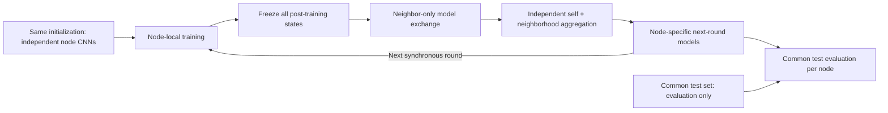

Every node trains from its own round-start model. All post-training snapshots are frozen before any neighborhood mean is calculated; all means are calculated before installing next-round models. There is no central server. The mean is weighted by local partition sample counts, including self. The static baseline uses this rule; Metropolis–Hastings mixing has not been implemented.

## Development figures

These figures summarize verified Milestones 1–4 development checks, **not final scientific results**. Partition, FedAvg, and decentralized comparisons use one seed (42), 10 clients, the full 60,000-sample Fashion-MNIST training set, and alpha values 10, 1, and 0.3. FedAvg and decentralized learning use three rounds, one local epoch per round, and the common 10,000-sample test set. One seed and three rounds do not establish statistical significance, convergence, or general performance rankings; no confidence intervals are inferred.

### 1. Historical centralized baseline

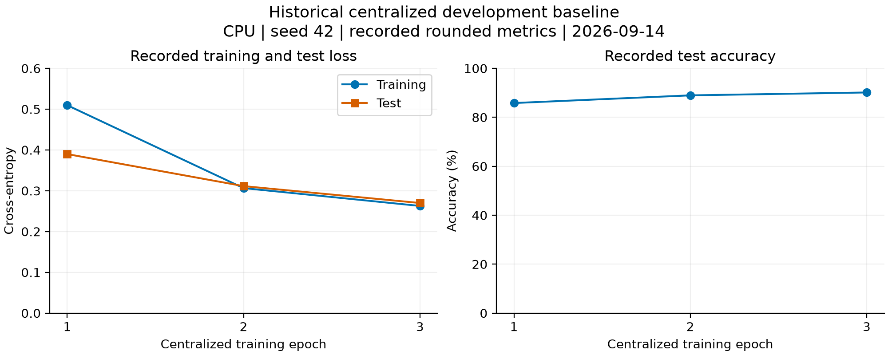

The original CPU development check (2026-09-14), plotted from the rounded metrics recorded in the research log. This confirms the initial centralized pipeline trained successfully. Epochs are not equivalent to FedAvg communication rounds; this separate historical figure is not a controlled centralized-versus-federated comparison. [Vector version](docs/figures/centralized_baseline.svg).

### 2. Client label distributions

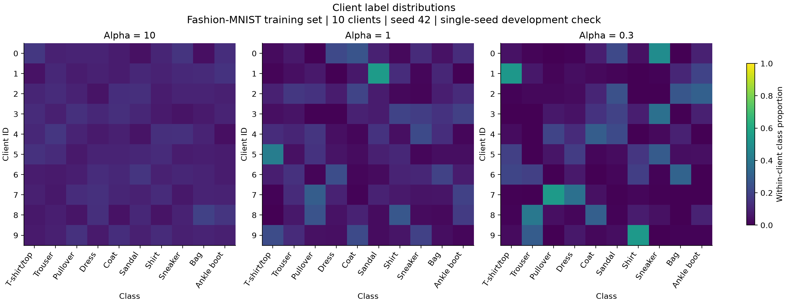

Rows are clients, columns are Fashion-MNIST classes, and each row sums to one. All panels share the same 0–1 color scale. The alpha 0.3 realization shows stronger concentration and missing classes in some clients. Client IDs identify simulated partitions, not real users or matched populations across alpha values. [Vector version](docs/figures/client_label_distributions.svg).

### 3. Client sample counts

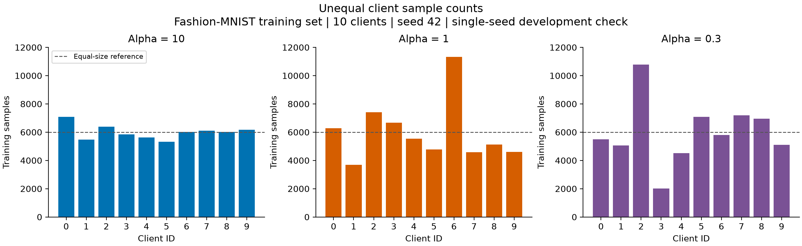

All panels use the same sample-count axis. The dashed 6,000-sample line is an equal-size reference, not an enforced allocation constraint. Unequal sizes motivate sample-weighted FedAvg; the realized size imbalance need not change monotonically with alpha. Every panel totals 60,000 samples. [Vector version](docs/figures/client_sample_counts.svg).

### 4. Observed label heterogeneity

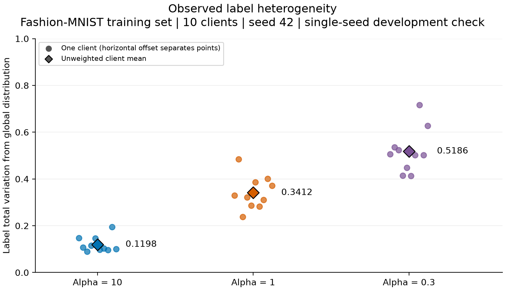

Each point is one client's label total variation from the global training distribution: `TV = 0.5 * sum_c |p_client(c) - p_global(c)|`. Diamonds are equally weighted client means (0.1198, 0.3412, 0.5186). Horizontal offsets only separate points. These are clients from a single partition, not independent experiment seeds or uncertainty estimates. TV here measures label skew, not model disagreement. [Vector version](docs/figures/label_heterogeneity.svg).

### 5. FedAvg learning curves

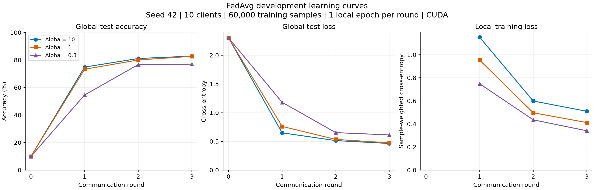

Round 0 is the common initial model evaluation; local training loss begins at round 1. All 10 clients and 60,000 training samples participate in every round. Test accuracy improves in these checks, reaching 82.86%, 82.68%, and 77.03% respectively. Local loss is measured during client updates and averaged by partition size; it is not the loss of the final aggregated model. Lower local loss does not imply better global accuracy. Lines connect observed rounds without smoothing or extrapolation. [Vector version](docs/figures/fedavg_learning_curves.svg).

### 6. Decentralized communication topologies

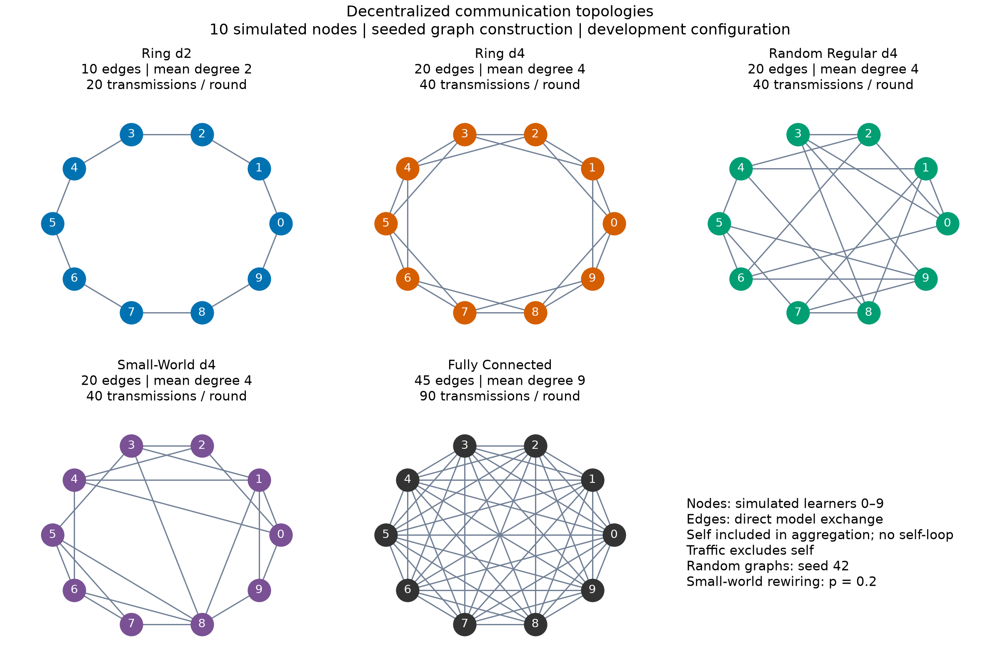

Nodes are simulated learners; edges indicate direct model exchange. Every aggregation includes the node's own model, without drawing a self-loop. Transmission counts exclude self. Random Regular and Small-World graphs use the experiment generator with seed 42 (Small-World rewiring probability 0.2). These graphs support single-seed, three-round development checks, with no confidence intervals, significance claims, or universal topology ranking. [Vector version](docs/figures/decentralized_topologies.svg).

### 7. Heterogeneity vs decentralized accuracy

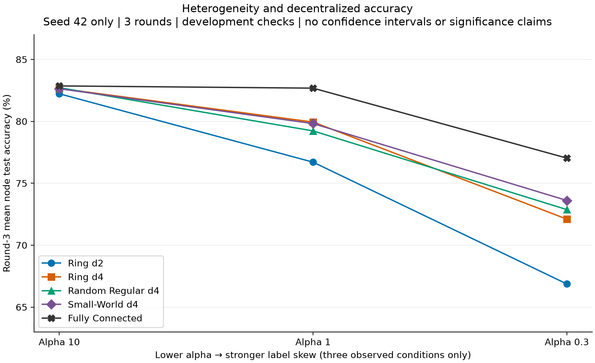

Lower alpha means stronger label skew. Lines connect only three observed conditions; they do not estimate a continuous function. In this single-seed, three-round development check, stronger label skew is associated with a larger gap between sparse and fully connected communication. There are no confidence intervals or statistical significance claims; this observation establishes neither causality nor a universal ranking. [Vector version](docs/figures/decentralized_heterogeneity_accuracy.svg).

### 8. Communication–accuracy trade-off

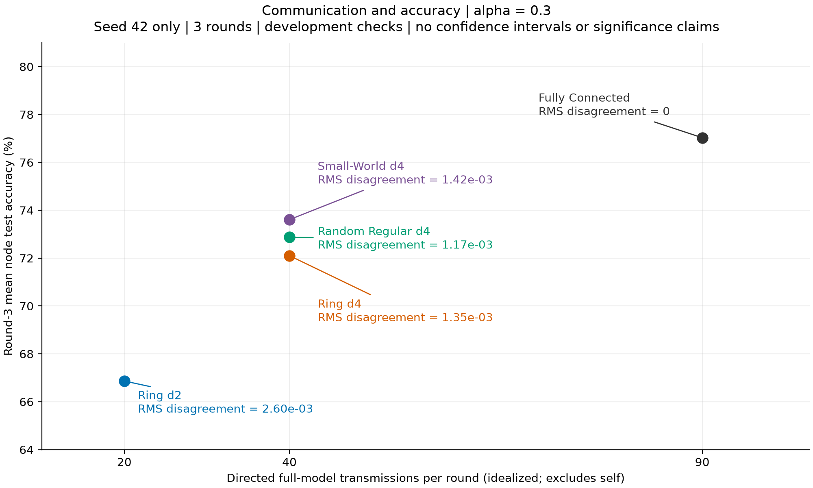

Alpha 0.3 is the strongest tested label-skew condition. Traffic counts idealized directed full-model exchanges per round, excluding self; it measures neither bytes nor runtime. Ring d4, Random Regular d4, and Small-World d4 each use 40 transmissions per round. Annotations show mean pairwise RMS parameter disagreement. These single-seed, three-round development observations have no confidence intervals or significance claims; no universal ranking or Pareto-optimality is claimed. [Vector version](docs/figures/decentralized_communication_accuracy.svg).

## Development observations

All observations below are **single-seed (42), three-round, development-only**; no confidence intervals or statistical significance are claimed.

- At alpha 10, tested degree-4 sparse graphs reach mean node accuracy 82.63–82.72%, close to the fully connected reference's 82.86%, using 40 versus 90 transmissions per round.
- At alpha 0.3, sparse configurations reach 66.87–73.61% versus 77.03% for fully connected. Ring d2 has lower accuracy and higher disagreement than the other tested configurations in this condition.
- Equal communication counts produce different observed behavior across the three degree-4 graphs.
- Fully Connected matches the FedAvg reference exactly in unrounded training loss, test loss, and accuracy for all three alphas and rounds; node accuracy spread and disagreement are zero under the current synchronous sample-count-weighted rule.

These short checks do not establish convergence, causality, or a topology that is universally best.

## Reproduce figures

```bash
python -m pip install -e ".[plots]"
python scripts/plot_development_checks.py
```

One command regenerates all eight PNG/SVG pairs without training, downloading data, or reading ignored raw results. The deliberately published [figure-data snapshot](docs/figure_data/development_checks.json) includes unrounded metrics, class counts, graph edges and metadata, configurations, verification dates, and source-file SHA-256 hashes. Milestones 1–3 retain their experiment commit; Milestone 4 references implementation commit `22aeb9ea560a20454a7bee8e37ecc8b672867d6d` and hashes of committed source files; original run-time source hashes are retained separately. Runs preceded the commit, and shared helpers were subsequently extracted without changing static training mathematics. Historical centralized values retain their recorded table precision. SVG text remains editable; rendering may vary with library or font versions.

To refresh the snapshot from the original local reports (this changes documentation data only):

```bash
python scripts/plot_development_checks.py --results-dir results --source-commit 8fb3cd9d45961305fa4010ec9c49c9fb78337622 --milestone4-source-commit 22aeb9ea560a20454a7bee8e37ecc8b672867d6d --verification-date 2026-09-17
```

These hashes identify the current development sources; use the appropriate source revision and verification date for later checks. Raw reports remain ignored under `results/`; see the [research log](docs/research_log.md) for the recorded measurements and environment.

## Run decentralized baseline

```bash
python -m tdl.decentralized.runner \
  --config configs/decentralized.yaml \
  --topology ring_degree_4 \
  --alpha 0.3 \
  --output results/decentralized_ring_degree_4_alpha_0.3.json
```

The example uses a Bash shell. In PowerShell, put the command on one line. The configuration uses seed 42, 10 nodes, one local epoch, three rounds, and `device: auto`. Nodes train sequentially on the selected device with fresh SGD optimizers per round. Reports include common-test evaluation per node, equally weighted node summaries, population accuracy standard deviation across nodes (not experiment uncertainty), RMS parameter disagreement, and idealized exchange counts.

Run the complete development matrix:

```bash
python scripts/run_decentralized_checks.py --alphas 10.0 1.0 0.3
```

This runs 15 development checks, not final multi-seed experiment replication. The matrix runner refuses to overwrite existing per-run reports; choose a fresh `--results-dir` when rerunning. Use `--summary-only` to summarize existing reports without training. Individual runner outputs should also use a fresh filename when preserving an existing report.

## Installation

Create a Python 3.11 or newer virtual environment, then install the project and test dependencies:

```bash
python -m pip install -e ".[dev]"
```

### Dynamic random communication: Epidemic Learning

EL-Local independently samples `k` distinct outgoing peers per node each round,
forming a directed random k-out graph with variable incoming degree. Nodes uniformly
average their locally trained model and received frozen models; zero incoming
updates retain the locally trained model. A sample-weighted control uses the same
sampled communication graphs.

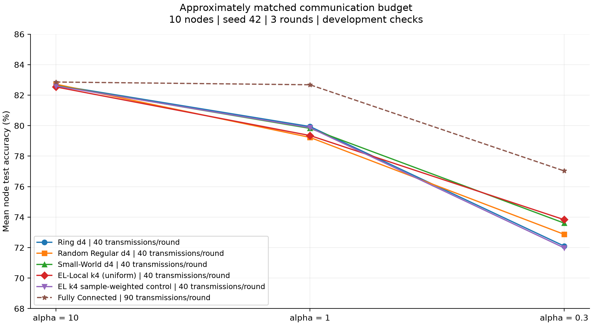

Ten nodes, seed 42, three rounds: development checks only, with no confidence
intervals or significance claims. Sparse methods use 40 model transmissions per
round; Fully Connected uses 90. EL-Local changes both topology dynamics and the
aggregation rule relative to static baselines. The sample-weighted EL control
helps separate those effects; these checks do not establish EL superiority.

### Guided dynamic communication: Morph

The baseline progression is static communication → Epidemic random dynamic
communication → Morph guided dynamic communication. Morph selects peers through
local discovery, without a central peer directory. The primary
`morph_code_faithful` mode follows the released request-serving semantics: each
receiver requests k models, and senders serve all requesters without an outgoing
cap. The separate experimental `morph_paper_capped` mode retains capped
negotiation and its known 39-edge failure despite a feasible 40-edge assignment.
[Source reconciliation](docs/morph.md) explains the distinction and the requested
three-guided/one-random selection adaptation from the released one-swap code.

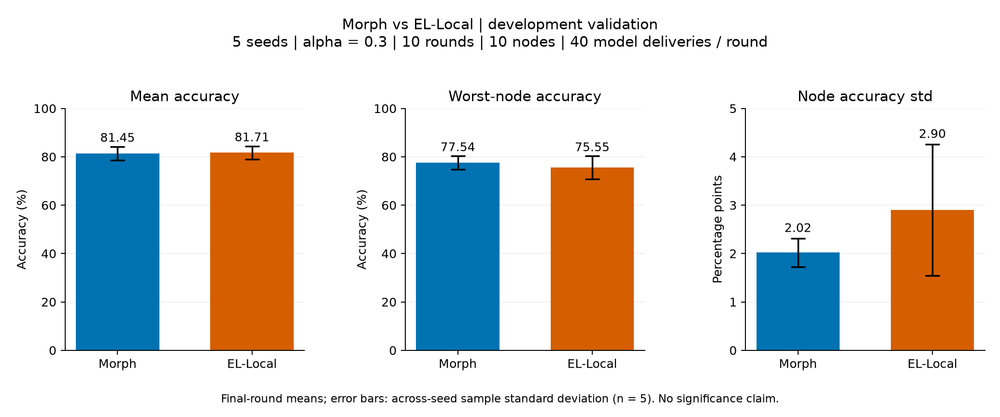

In the current five-seed development check, Morph and EL achieved similar mean
accuracy (81.446% and 81.707%), while Morph showed higher average worst-node
accuracy (77.538% and 75.552%) and lower node-level variability. Error bars show
across-seed sample standard deviation, not confidence intervals; no statistical
significance is claimed. Both used uniform aggregation and 40 measured model
deliveries per round over ten rounds at alpha=0.3. Early guided slots were entirely
fallback-driven in rounds 1–2. Morph retained four incoming peers but was not
strongly connected in 10 of 50 round graphs; all remained weakly connected.

## GPU setup

The centralized, FedAvg, and decentralized configurations use `device: auto`, which automatically selects CUDA when PyTorch detects a supported NVIDIA GPU. Install an appropriate CUDA-enabled PyTorch wheel inside the project virtual environment; use the [official PyTorch installation guide](https://pytorch.org/get-started/locally/) to choose a build for your hardware and driver.

This development machine was verified with the official `cu130` wheel:

```bash
python -m pip uninstall torch torchvision -y
python -m pip install torch torchvision --index-url https://download.pytorch.org/whl/cu130
python -m pip install -e ".[dev]"
```

The `cu130` build is the tested choice for this machine, not a requirement for every NVIDIA GPU. The CUDA version shown by `nvidia-smi` indicates driver compatibility and does not need to exactly match `torch.version.cuda`. Normal training with PyTorch binaries uses their bundled CUDA runtime and the installed NVIDIA driver; the full CUDA Toolkit and `nvcc` are not required.

Verify GPU detection, then run the existing development baseline:

```bash
python -c "import torch; print(torch.__version__); print(torch.version.cuda); print(torch.cuda.is_available()); print(torch.cuda.device_count()); print(torch.cuda.get_device_name(0) if torch.cuda.is_available() else 'No CUDA GPU')"
python -m tdl.training.centralized --config configs/centralized.yaml
```

GPU verification should report `True` for CUDA availability and the detected GPU name. Keep `device: auto`; the baseline should print `Device: cuda` when CUDA is available.

## Inspect client partitions

Partition Fashion-MNIST training labels without training a model:

```bash
python -m tdl.data.inspect_partition --config configs/partition.yaml
```

The default is 10 clients, seed 42, alpha 0.3, and at least one sample per client. The command prints per-client sample and class counts, verifies exact coverage and repeatability, and writes `results/partition_summary.json`. Use `--alpha` and `--output` to inspect other concentrations and retain separate local JSON summaries. Generated results and datasets remain ignored by Git.

Each class receives an independent symmetric Dirichlet allocation. Larger alpha tends toward similar class allocations; smaller alpha favors label skew. Client sizes are not fixed. Allocations that violate the minimum are rejected using the same seeded RNG, with a default limit of 1000 attempts and a clear error if none succeeds. The JSON also reports mean label total variation from the global distribution (smaller values indicate more similar label proportions).

## Run the FedAvg baseline

```bash
python -m tdl.federated.fedavg --config configs/fedavg.yaml
```

The default simulates 10 clients sequentially for three rounds with one local epoch per round, seed 42, and alpha 0.3. Each client trains a separate copy of the same global model; the server averages model states using partition sample counts. Every client participates, and a fresh SGD optimizer is used for each client in each round. `device: auto` selects CUDA when available.

The runner evaluates the initial model and the global model after every round, prints weighted client loss and global test metrics, and saves configuration, device metadata, partition counts, and round metrics to ignored `results/fedavg_summary.json`. Override `--alpha` and `--output` for separate development checks.

Client training and independent DataLoader generators use `seed + round_number * num_clients + client_id`, with rounds starting at 1. Initialization uses the main seed, and partitioning uses its own seeded NumPy RNG. The existing seed helper enables deterministic cuDNN behavior; reproducibility across different hardware or library versions is not guaranteed. This is a centralized federated comparison baseline, with no peer-to-peer communication or attacks.

### Centralized FedAvg comparison workflow

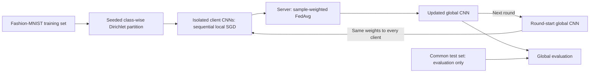

This comparison baseline uses a central aggregation server. The separate decentralized workflow above uses neighborhood exchange. Both keep test data outside local training partitions.
